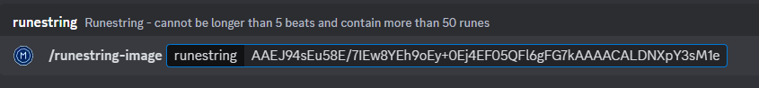
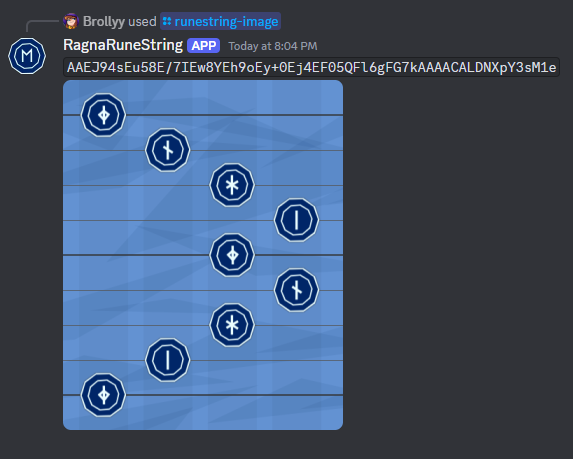

# RagnaRuneStringDiscordVisualizer

Small Discord bot for creating visualizations of runestrings generated with the [RagnaRuneString](https://github.com/Brollyy/RagnaRuneString) library.

  <br> 

## RagnaRuneStringVisualizer

Small library that uses assets from [Edda by PKBeam](https://github.com/PKBeam/Edda) to render images of the runestrings using `ImageGenerator` class.

Can be used as a standalone library for other purposes than this Discord bot.

Only .NET 8.0 Windows Runtime is supported.

### Examples

Rendering image to a stream:

```csharp
using RagnaRuneStringVisualizer;
using System.Drawing.Imaging;                                       // For ImageFormat

var imageGenerator = new ImageGenerator(
    "AAEJ+IsEvJ8EgLMExMYEiNoEzO0EkIEF1JQFmKgFG7kAAAACALDNXpY3sM1e", // Example runestring
    "."                                                             // Base path to folder with required Resources
);
using (var memoryStream = new MemoryStream()) {
    imageGenerator.RenderToStream(memoryStream, ImageFormat.Png);   // Render contents of the image
    memoryStream.Position = 0;                                      // Reset position to start 
    
    // Use the stream for stuff
}
```

Rendering image to a file:

```
using RagnaRuneStringVisualizer;
using System.Drawing.Imaging;                                       // For ImageFormat

var imageGenerator = new ImageGenerator(
    "AAEJ+IsEvJ8EgLMExMYEiNoEzO0EkIEF1JQFmKgFG7kAAAACALDNXpY3sM1e", // Example runestring
    "."                                                             // Base path to folder with required Resources
);
imageGenerator.RenderToFile("image.png", ImageFormat.Png);          // Render contents of the image to file
```

### RagnaRuneStringVisualizerTest

Command-line tool for testing `RagnaRuneStringVisualizer` during development.

## ServerlessDiscordBot

Discord bot running on Microsoft Azure and [Discord.Net](https://github.com/discord-net/Discord.Net).

Due to serverless architecture, only Discord Interactions are handled, using `Interactions Endpoint URL` setting.

### Environment Variables

There are a few environment variables that need to be defined in Azure Function App for the code to work properly.

| Variable | Description |
| - | - |
| `DiscordPublicKey` | Discord App Public Key - found in the "General Information" tab |
| `DiscordBotToken` | Discord App Bot Token - found in the Discord App "Bot" tab |
| `DiscordAdminUserId` | Discord User ID to be notified in case of issues with the bot |

### Commands

All the commands are registered using [SlashCommandModule](./ServerlessDiscordBot/Modules/SlashCommandModule.cs). 

Slash Commands are expected to respond to their interaction within the handler code.

| Command | Input | Description |
| - | - | - | - |
| `runestring-image` | `runestring: Text` | Renders an image that shows the contents of the runestring. <br> Runestring - cannot be longer than 5 beats and contain more than 50 runes |

### Azure Setup

All the bot functionality runs on a single Function App `rangarunestring` (noticed the typo too late to reconfigure everything from scratch).

Runtime version ~4, running on Windows, with .NET 8 (LTS) In-process stack.

There's a Github Action available on repository that handles the deployment on every push to `main` branch.

| Function | Trigger | Authorization | Description |
| - | - | - | - |
| `HandleDiscordInteraction` | `HttpTrigger(post)` | `Function` | Handles all the requests sent from Discord. You need to register this function's URL as your Discord's App Interactions Endpoint URL (including `?code={function_key}`). |
| `RegisterSlashCommands` | `HttpTrigger(post)` | `Admin` | Registers all commands from `SlashCommandModule` as global commands for the application. Run this manually only after doing changes to the commands.

### Local testing

To test the functions locally, refer to [the documentation](https://learn.microsoft.com/en-us/azure/azure-functions/functions-develop-local).

To connect the functions that are running locally with your Discord App for testing purposes, you'll need to run [ngrok](https://ngrok.com) (or any other similar tool) to expose your local Azure Functions server (typically running on port 7071) to the internet.